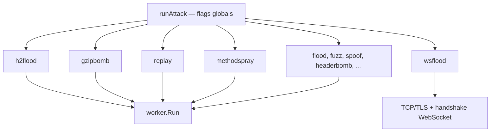

# limithit

CLI em Go para **simulação de ataques HTTP** e testes de resiliência. Permite reproduzir vetores reais de DDoS, esgotamento de conexão, bypass de rate limit e enumeração de endpoints — tudo contra seu próprio ambiente, antes que um atacante real o faça.

Sem dependências externas — stdlib Go apenas.

---

## Requisitos

- Go 1.22+

## Instalação

```bash
git clone https://github.com/conantorreswf/limithit.git
cd limithit
go build -o limithit .
```

---

## Uso geral

```
limithit <comando> [flags] <url>
```

A URL pode vir em qualquer posição — antes ou depois das flags:

```bash
./limithit flood http://localhost:8080/api/ping --total 500
./limithit flood --total 500 http://localhost:8080/api/ping  # equivalente
```

---

## Arquitetura de execução

Todo subcomando passa pelo mesmo ponto de entrada (`internal/cli/cli.go` → `runAttack`). Antes de chamar o ataque, o CLI monta um `attacks.Base` com dependências compartilhadas: URL, `http.Client` (quando aplicável), total/concorrência/timeout e, opcionalmente, um `Pacer` para modelar a taxa de envio.



### Flags globais (valem para qualquer comando)

| Flag | Efeito |
|------|--------|
| `--ramp-start` + `--ramp-duration` | Aumenta a taxa linearmente até o ritmo “cheio” (via `metrics.Pacer`) |
| `--keepalive=false` | Força handshake TCP/TLS novo a cada requisição HTTP |
| `--expect-status` | Exit code 1 se o status esperado (ex.: 429) não aparecer no relatório |

### Dois caminhos de execução

**Pool HTTP (`worker.Run`)** — A maioria dos ataques monta requisições e delega ao worker pool genérico (`internal/worker/worker.go`). Workers consomem jobs de um canal, respeitam o `Pacer` entre envios e agregam resultados em `metrics.Report` (contagens por status, RPS, latência, etc.).

Ataques neste caminho: `flood`, `fuzz`, `spoof`, `headerbomb`, `h2flood`, `gzipbomb`, `replay`, `methodspray`.

**Socket cru** — `slowloris` e `wsflood` abrem conexões TCP/TLS diretamente, sem `http.Client`. Mantêm conexões abertas (HTTP incompleto ou WebSocket) e reportam via `metrics.ConnReport` (`Established`, `Rejected`, `AvgHold`, …).

Cada pacote em `internal/attacks/<nome>/` implementa a interface `Attack` (registrada em `init()`), com flags próprias além das globais acima.

---

## Comandos

### `flood` — Flood de requisições

Dispara N requisições em paralelo o mais rápido possível. Modo clássico de carga.

**O que testa:**
- Rate limit global do servidor (quantas req/s o sistema aguenta antes de 429)
- Latência sob carga
- Estabilidade do servidor com concorrência alta

```bash
./limithit flood <url> [flags]
```

| Flag | Default | Descrição |
|------|---------|-----------|
| `--total` | 100 | Total de requisições |
| `--concurrency` | 10 | Workers simultâneos |
| `--method` | GET | Método HTTP (GET/POST/PUT/PATCH/DELETE/HEAD) |
| `--body` | "" | Corpo da requisição |
| `--header` | — | Header `"Chave: Valor"` (repetível) |
| `--timeout` | 10 | Timeout por request (segundos) |

**Exemplos:**

```bash
# Flood GET básico
./limithit flood http://localhost:8080/api/ping --total 1000 --concurrency 50

# Flood POST com JSON
./limithit flood http://localhost:8080/api/echo \
  --method POST \
  --body '{"user":"alice"}' \
  --header 'Content-Type: application/json' \
  --total 500 --concurrency 20
```

**Saída:**
```
=== limithit flood summary ===
Sent:         1000
Success(2xx): 50
Client(4xx):  950   (429: 950, 431: 0, 413: 0)
Server(5xx):  0
Errors:       0   (timeouts: 0)
Duration:     48ms
RPS:          20833.33

Status distribution:
  200: 50
  429: 950
```

---

### `slowloris` — Esgotamento de conexões lentas

Abre muitas conexões TCP simultâneas e **mantém elas abertas indefinidamente**, enviando headers HTTP incompletos em intervalos regulares — sem nunca finalizar a requisição.

**O que testa:**
- Limite de conexões simultâneas do servidor
- Presença (ou ausência) de `ReadHeaderTimeout` e `IdleTimeout`
- Se o servidor tem proteção contra clientes lentos/maliciosos

**Como funciona o ataque:**
Um servidor sem timeout aguarda indefinidamente que o cliente envie o `\r\n\r\n` que finaliza os headers. Com 200+ conexões presas, novos clientes legítimos não conseguem conectar.

**Como a defesa funciona:**
Com `ReadHeaderTimeout=5s` no testserver, o servidor fecha a conexão após 5s sem headers completos — o limithit detecta via leitura e reporta `DroppedByServer`.

```bash
./limithit slowloris <url> [flags]
```

| Flag | Default | Descrição |
|------|---------|-----------|
| `--connections` | 200 | Conexões simultâneas abertas |
| `--header-interval` | 10 | Segundos entre cada drip de header |
| `--hold` | 120 | Duração máxima de cada conexão (segundos) |
| `--dial-timeout` | 5 | Timeout de conexão TCP (segundos) |
| `--insecure` | false | Ignorar verificação TLS |

**Exemplos:**

```bash
# 50 conexões por 30s (detecta se servidor fecha antes)
./limithit slowloris http://localhost:8080 \
  --connections 50 \
  --hold 30 \
  --header-interval 3

# Ataque pesado — 500 conexões por 2 minutos
./limithit slowloris http://localhost:8080 \
  --connections 500 \
  --hold 120 \
  --header-interval 10
```

**Saída:**
```
=== limithit slowloris summary ===
Attempted:        50
Established:      50
DroppedByServer:  50        ← servidor fechou ativamente (PROTEGIDO)
DroppedByClient:  0
AvgHold:          6.001s    ← caiu em ~6s (ReadHeaderTimeout=5s)
MaxHold:          6.002s
BytesSent:        8970
Duration:         6.038s
```

**Sem proteção** (servidor sem `ReadHeaderTimeout`), `DroppedByServer` fica em 0 e `AvgHold` bate o `--hold` configurado — o servidor ficou preso.

---

### `spoof` — Rotação de IP + pacing variável

Injeta header `X-Forwarded-For` com IPs diferentes em cada requisição, simulando um ataque **distribuído de múltiplas origens**. Suporta pacing com distribuição estatística.

**O que testa:**
- Se rate limit é por IP ou global (IP global é bypassável com spoof)
- Se o servidor confia em XFF sem validar origem do proxy
- Detecção de padrões anômalos de tráfego distribuído

**Como funciona o ataque:**
Servidores que aplicam rate limit por IP baseando-se em `X-Forwarded-For` sem validar a origem do proxy são vulneráveis: cada requisição usa um IP "diferente", nunca atingindo o limite de nenhum IP individualmente.

**Como a defesa funciona:**
O testserver só confia em XFF de IPs na lista `--trust-xff-cidr`. Fora dessa lista, usa `RemoteAddr` real — spoof não funciona.

```bash
./limithit spoof <url> [flags]
```

| Flag | Default | Descrição |
|------|---------|-----------|
| `--ip-pool` | — | Pool de IPs **(obrigatório)**: CIDR, arquivo ou lista |
| `--total` | 1000 | Total de requisições |
| `--concurrency` | 20 | Workers simultâneos |
| `--pacing` | none | Estratégia de delay: `uniform`, `poisson`, `zipf`, `none` |
| `--min-delay-ms` | 0 | Delay mínimo entre requests por worker (ms) |
| `--max-delay-ms` | 50 | Delay máximo entre requests por worker (ms) |
| `--rps` | 50 | RPS alvo para pacing `poisson` |
| `--xff-header` | X-Forwarded-For | Nome do header de IP injetado |
| `--method` | GET | Método HTTP |
| `--timeout` | 10 | Timeout por request (segundos) |

**Formatos de `--ip-pool`:**

```bash
--ip-pool 10.0.0.0/24          # CIDR — expande até 65536 IPs
--ip-pool "1.1.1.1,2.2.2.2"   # lista separada por vírgula
--ip-pool file:/caminho/ips.txt # arquivo, um IP por linha
```

**Estratégias de pacing:**

| Estratégia | Comportamento | Quando usar |
|------------|---------------|-------------|
| `none` | Sem delay — máximo throughput | Testar rate limit bruto |
| `uniform` | Delay aleatório uniforme entre `min` e `max` | Simular múltiplos clientes normais |
| `poisson` | Intervalos exponenciais baseados em `--rps` | Modelar tráfego real (distribuição de Poisson) |
| `zipf` | Poucos IPs muito ativos, maioria raramente | Simular botnet com nós dominantes |

**Exemplos:**

```bash
# Spoof via CIDR, sem delay
./limithit spoof http://localhost:8080/api/ping \
  --ip-pool 10.0.0.0/28 \
  --total 500

# Simular botnet (pacing zipf + pool grande)
./limithit spoof http://localhost:8080/api/ping \
  --ip-pool 192.168.0.0/16 \
  --pacing zipf \
  --min-delay-ms 10 --max-delay-ms 500 \
  --total 5000 --concurrency 50

# Tráfego realista distribuído (poisson ~30 req/s)
./limithit spoof http://localhost:8080/api/ping \
  --ip-pool file:ips.txt \
  --pacing poisson --rps 30 \
  --total 2000 --concurrency 30
```

**Saída:**
```
=== limithit spoof (pool=16 pacing=zipf) summary ===
Sent:         500
Success(2xx): 500         ← 100% passou — por-IP limit bypassado!
Client(4xx):  0
...
```

---

### `fuzz` — Enumeração de endpoints + cache busting

Dispara requisições para uma lista de paths comuns (`/admin`, `/.env`, `/api/v1/users`, etc.), opcionalmente com query param aleatório para burlar caches.

**O que testa:**
- Endpoints expostos acidentalmente (`/admin`, `/.git/config`, `/actuator/env`, etc.)
- Arquivos sensíveis acessíveis publicamente (`.env`, `backup.zip`, etc.)
- Se o cache retorna dados stale quando deveria recomputar (cache busting)
- Eficiência do rate limit em paths variados

**Como funciona:**
Cada requisição usa um path da wordlist. Com `--cache-bust`, um query param `?_cb=<hex aleatório>` é anexado, forçando o servidor (e CDNs) a tratar cada request como única — bypassando caches.

```bash
./limithit fuzz <url-base> [flags]
```

| Flag | Default | Descrição |
|------|---------|-----------|
| `--wordlist` | embutida (100 paths) | Arquivo com paths, um por linha |
| `--cache-bust` | false | Adicionar `?_cb=<hex>` a cada request |
| `--total` | 1000 | Total de requisições |
| `--concurrency` | 20 | Workers simultâneos |
| `--timeout` | 10 | Timeout por request (segundos) |

**Wordlist embutida (seleção):**
```
/admin  /admin/login  /api  /api/v1/users  /api/auth
/.env  /.git/config  /.htaccess  /.htpasswd
/backup  /backup.zip  /dump.sql
/actuator/env  /actuator/health
/phpmyadmin  /phpinfo  /wp-admin  /wp-login.php
/swagger  /openapi.json  /graphql
/server-status  /console  /robots.txt  ...
```

**Exemplos:**

```bash
# Fuzzing básico com wordlist padrão
./limithit fuzz http://localhost:8080 --total 500

# Com cache busting + wordlist customizada
./limithit fuzz http://localhost:8080 \
  --wordlist /caminho/minha-wordlist.txt \
  --cache-bust \
  --total 2000 --concurrency 30

# Detectar endpoints em API externa (com rate)
./limithit fuzz https://api.meusite.com \
  --cache-bust --total 500 --concurrency 5 --timeout 5
```

**Saída (per-path):**
```
Per-path status (top 20 by hits):
  /api/ping                                 200:10
  /api/auth                                 405:10
  /admin                                    200:10  ← ATENÇÃO: admin acessível!
  /.env                                     200:10  ← CRÍTICO: .env exposto!
  /api/v1/users                             404:10
  /wp-admin                                 404:10
```

---

### `headerbomb` — Headers gigantes + payload progressivo

Envia requisições com **centenas de headers repetidos** e **bodies crescentes**, testando se o servidor tem limites configurados de parsing.

**O que testa:**
- Limite de tamanho de headers (`MaxHeaderBytes` — padrão Go: 1MB sem config!)
- Limite de tamanho de body (evita OOM por payload enorme)
- Se o servidor retorna `431 Request Header Fields Too Large` e `413 Payload Too Large`
- Resistência a headers malformados e payloads abusivos

**Como funciona:**
Cada request injeta N headers `X-Junk-0`, `X-Junk-1`, ..., `X-Junk-N` com valores de tamanho configurável. O body cresce progressivamente de `--body-start` até `--body-max` (dobrando a cada step).

**Como a defesa funciona:**
Com `MaxHeaderBytes: 16<<10` (16KB) no testserver, qualquer request com headers maiores recebe `431`. Sem esse config, o servidor processa todos os bytes — potencial OOM.

```bash
./limithit headerbomb <url> [flags]
```

| Flag | Default | Descrição |
|------|---------|-----------|
| `--header-count` | 500 | Quantidade de headers X-Junk por request |
| `--header-size` | 1024 | Tamanho do valor de cada header (bytes) |
| `--body-start` | 1024 | Tamanho inicial do body (bytes) |
| `--body-max` | 16MB | Tamanho máximo do body |
| `--body-step` | 0 | Incremento por step (0 = dobrar a cada vez) |
| `--total` | 50 | Total de requisições |
| `--concurrency` | 5 | Workers simultâneos |
| `--method` | auto | POST se body > 0, GET caso contrário |
| `--timeout` | 15 | Timeout por request (segundos) |

**Exemplos:**

```bash
# Testar limite de headers (100 headers × 256B = 25KB)
./limithit headerbomb http://localhost:8080/api/echo \
  --header-count 100 --header-size 256 \
  --body-start 0 --body-max 0 \
  --total 10

# Payload crescente sem headers extras
./limithit headerbomb http://localhost:8080/api/echo \
  --header-count 0 \
  --body-start 1024 --body-max 33554432 \
  --total 20

# Combinado: headers gigantes + body progressivo
./limithit headerbomb http://localhost:8080/api/echo \
  --header-count 500 --header-size 1024 \
  --body-start 1024 --body-max 16777216 \
  --total 30 --concurrency 3
```

**Saída:**
```
=== limithit headerbomb (hdrs=500x1024B body=1024→16777216B) summary ===
Sent:         30
Success(2xx): 0
Client(4xx):  30   (429: 0, 431: 30, 413: 0)
                     ↑ todos bloqueados por MaxHeaderBytes (PROTEGIDO)
BytesSent:    0.02 MB
```

---

## testserver — Servidor alvo local

Servidor HTTP com dashboard em tempo real. Cada modo de ataque tem uma defesa correspondente que pode ser observada ao vivo.

### Subindo o servidor

```bash
cd testserver
go run . [flags]
```

| Flag | Default | Descrição |
|------|---------|-----------|
| `--port` | 8080 | Porta de escuta |
| `--rate` | 0 (desabilitado) | Rate limit por IP em req/s |
| `--burst` | igual a `--rate` | Burst permitido |
| `--trust-xff-cidr` | "" (ignorar XFF) | CIDRs de proxies confiáveis (honrar XFF) |
| `--auth-user` | admin | Usuário do endpoint `/api/auth` |
| `--auth-pass` | changeme | Senha do endpoint `/api/auth` |

### Endpoints

| Método | URL | Descrição |
|--------|-----|-----------|
| GET | `/` | Dashboard web em tempo real |
| GET | `/api/ping` | Retorna `{"pong":true}` |
| POST | `/api/echo` | Ecoa body JSON (limite 1MB) |
| POST | `/api/auth` | Login com lockout após 5 falhas |
| GET | `/metrics` | Stream SSE de métricas (usado pelo dashboard) |

### Proteções implementadas

| Proteção | Configuração | Ataque mitigado |
|----------|-------------|-----------------|
| Rate limit por IP | `--rate N --burst N` | `flood`, `spoof` |
| `ReadHeaderTimeout: 5s` | sempre ativo | `slowloris` |
| `IdleTimeout: 30s` | sempre ativo | `slowloris` (keepalive) |
| `MaxHeaderBytes: 16KB` | sempre ativo | `headerbomb` |
| XFF trust list | `--trust-xff-cidr` | `spoof` |
| Auth lockout (5 falhas/min → 5min bloqueado) | sempre ativo | brute force |

### `--trust-xff-cidr` — controle de spoof

```bash
# Confiar em XFF de conexões locais (loopback)
go run . --rate 10 --trust-xff-cidr 127.0.0.0/8

# Sem trust list — ignora todo XFF (mais seguro contra spoof externo)
go run . --rate 10
```

**Com trust ativo** e `--ip-pool 10.0.0.0/24`: cada IP do pool tem seu próprio bucket → spoof funciona se o pool for grande o suficiente.

**Sem trust**: todo tráfego de `127.0.0.1` compartilha 1 bucket → rate limit por IP real funciona.

### Dashboard

Abrir `http://localhost:8080` no navegador. Atualiza a cada 500ms via SSE.

Painéis:
- **Contadores** — GET, POST, total 429, latência média
- **Timeline** — gráfico req/s dos últimos 60 segundos
- **Histograma de latência** — distribuição em 7 buckets (<5ms até >250ms)
- **Top offenders** — 10 IPs com mais 429s (requer `--rate > 0`)
- **Log recente** — últimas 20 requisições com método, path, status e latência

---

## Cenários de teste completos

### Cenário 1 — Validar rate limit por IP

```bash
# Terminal 1: servidor com rate limit por IP
cd testserver && go run . --rate 5 --burst 5

# Terminal 2: flood que deve ser barrado
./limithit flood http://localhost:8080/api/ping --total 200 --concurrency 30

# Esperado: ~5-10 × 200 (429 maioria), dashboard mostra offender 127.0.0.1
```

### Cenário 2 — Testar proteção contra spoof

```bash
# Terminal 1: servidor SEM trust XFF (proteção ativa)
cd testserver && go run . --rate 5 --burst 5

# Terminal 2: spoof — todos vão parecer 127.0.0.1, cair no mesmo bucket
./limithit spoof http://localhost:8080/api/ping \
  --ip-pool 10.0.0.0/24 --total 200

# Esperado: maioria 429 (IPs spoofados ignorados, rate real = 127.0.0.1)

# Agora com trust ativo — spoof FUNCIONA
cd testserver && go run . --rate 5 --burst 5 --trust-xff-cidr 127.0.0.0/8
./limithit spoof http://localhost:8080/api/ping \
  --ip-pool 10.0.0.0/24 --total 200

# Esperado: maioria 200 (cada IP tem seu bucket separado — vulnerabilidade!)
```

### Cenário 3 — Detectar endpoints expostos

```bash
# Terminal 1
cd testserver && go run .

# Terminal 2
./limithit fuzz http://localhost:8080 --cache-bust --total 200

# Verificar na saída quais paths retornam 200 vs 404
# /api/auth, /api/ping, /api/echo, / devem aparecer como 200/405
```

### Cenário 4 — Testar proteção contra slowloris

```bash
# Terminal 1: servidor com ReadHeaderTimeout (padrão do testserver)
cd testserver && go run .

# Terminal 2
./limithit slowloris http://localhost:8080 --connections 50 --hold 15 --header-interval 3

# Esperado: DroppedByServer=50, AvgHold~5-6s (ReadHeaderTimeout em ação)
# Se DroppedByServer=0 e AvgHold=15s → servidor vulnerável
```

### Cenário 5 — Testar limites de parsing

```bash
# Terminal 1
cd testserver && go run .

# Terminal 2: headers que ultrapassam MaxHeaderBytes=16KB
./limithit headerbomb http://localhost:8080/api/echo \
  --header-count 100 --header-size 256 --total 5

# Esperado: 431 em todos — MaxHeaderBytes protege
# Sem MaxHeaderBytes configurado → 200 (servidor processou tudo — vulnerável)
```

### Cenário 6 — Brute force em /api/auth

```bash
# Terminal 1
cd testserver && go run . --auth-pass secreto123

# Terminal 2: múltiplas tentativas com senha errada
for i in $(seq 1 8); do
  curl -s -w "tentativa $i: %{http_code}\n" -o /dev/null \
    -X POST http://localhost:8080/api/auth \
    -H 'Content-Type: application/json' \
    -d '{"user":"admin","pass":"errada"}'
done

# Esperado: 401×4, 423 na 5ª (lockout ativado), 423 nas seguintes
```

---

## Estrutura do projeto

```
limithit/
├── main.go                        # dispatcher de subcomandos
├── internal/
│   ├── cli/
│   │   ├── cli.go                 # runAttack + flags globais
│   │   └── common.go              # extractURLArg, helpers
│   ├── attacks/
│   │   ├── attack.go              # interface Attack + Base
│   │   ├── registry.go            # Register / Lookup
│   │   ├── all/all.go             # blank imports → init() de cada ataque
│   │   ├── flood/                 # flood de requests
│   │   ├── slowloris/             # esgotamento HTTP/1 (socket cru)
│   │   ├── spoof/                 # rotação de IP + pacing
│   │   ├── fuzz/                  # enumeração de paths
│   │   ├── headerbomb/            # headers/body abusivos
│   │   ├── h2flood/               # flood HTTP/2 multiplexado
│   │   ├── wsflood/               # exaustão WebSocket (socket cru)
│   │   ├── gzipbomb/              # amplificação gzip
│   │   ├── replay/                # replay HAR / arquivo de reqs
│   │   └── methodspray/           # matriz método × path
│   ├── client/client.go           # http.Client com transport tuning
│   ├── worker/worker.go           # worker pool genérico
│   └── metrics/
│       ├── metrics.go             # collector thread-safe + relatório HTTP
│       ├── connreport.go          # métricas de conexão (slowloris, wsflood)
│       ├── pacer.go               # uniform / poisson / zipf / ramp
│       ├── ippool.go              # CIDR expansion + rotação
│       ├── wordlist.go            # wordlist embutida + arquivo externo
│       └── paths.txt              # 100 paths padrão para fuzz
└── testserver/
    ├── main.go                    # servidor + hardening + flags
    ├── ratelimit/ratelimit.go     # LimiterRegistry por IP + ClientIP()
    ├── store/store.go             # métricas + top offenders
    ├── handler/
    │   ├── api.go                 # PingHandler, EchoHandler
    │   ├── auth.go                # AuthHandler com lockout
    │   ├── dashboard.go           # serve HTML
    │   └── metrics_sse.go         # stream SSE
    └── dashboard/index.html       # dashboard com top offenders
```

---

> **Aviso legal:** use apenas contra sistemas que você possui ou tem autorização explícita para testar. Ataques não autorizados são ilegais.
